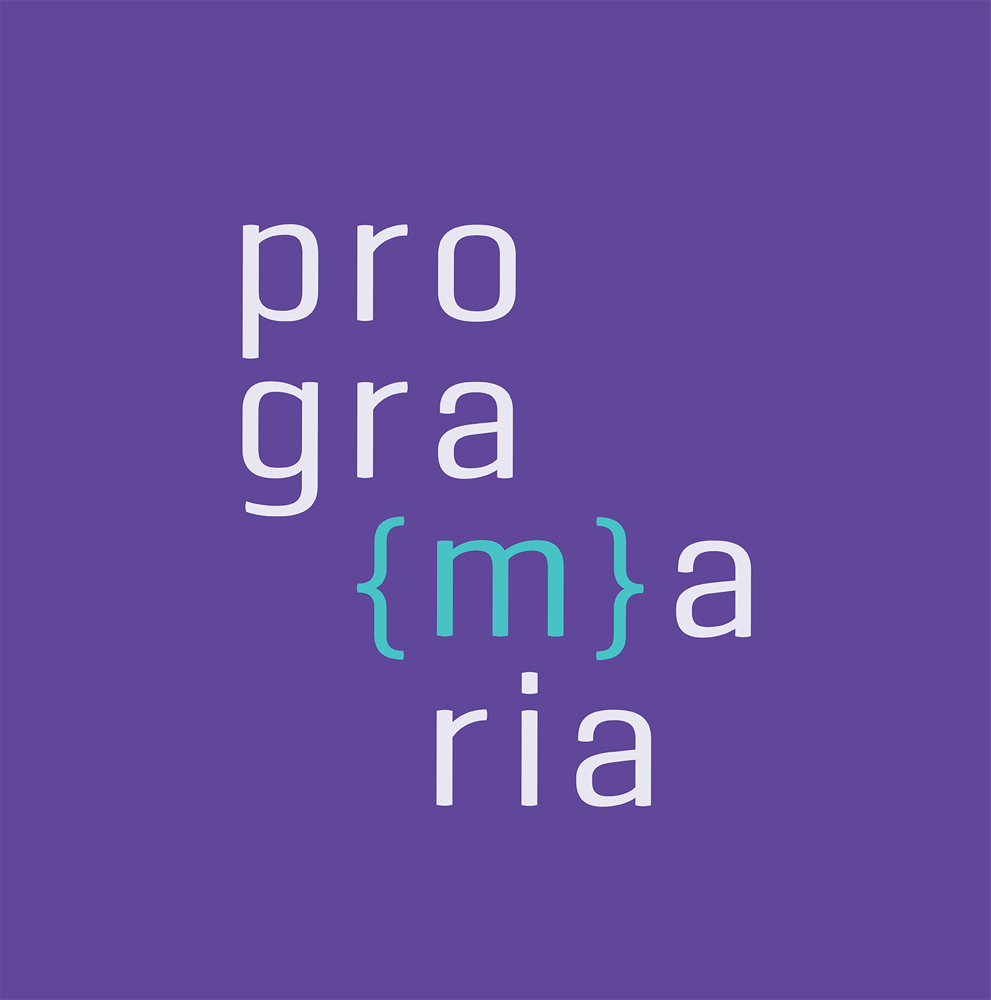

  

# 📊 Análise de Dados — Eu ProgrAmo | PrograMaria 2026

> Repositório desenvolvido durante o curso **Eu ProgrAmo — Análise de Dados: Meus primeiros passos em Python**, realizado pela [PrograMaria](https://www.programaria.org/) na turma de março de 2026.

---

## 📝 Sobre o projeto

Este repositório reúne as análises e exercícios práticos desenvolvidos ao longo do curso, cobrindo desde a exploração inicial de dados em Excel até a construção de um dashboard interativo e uma introdução ao aprendizado de máquina.

O curso teve carga horária de **20 horas** e foi concluído em **27/04/2026**, com bolsa de estudos concedida pela PrograMaria.

## 🚀 Conteúdo abordado

### 🟡 Excel
- Exploração e limpeza de dados em planilha
- Entendimento da estrutura dos dados antes de migrar para Python

### 🐍 Python — Google Colab
- **Pandas** — manipulação e transformação de dados
- **Matplotlib** — visualizações estáticas
- **Seaborn** — gráficos estatísticos
- **Plotly** — visualizações interativas

### 🗄️ SQL — DBeaver
- Consultas com `SELECT`, `WHERE`, `GROUP BY`, `JOIN`
- Exploração de dados via queries em uma segunda planilha
- Integração do SQL com Pandas (leitura de resultados diretamente no DataFrame)

### 📈 Looker Studio
- Construção de dashboard interativo com os dados trabalhados
- 

- 👉 [Acesse o dashboard aqui](https://datastudio.google.com/reporting/79e1cf59-d8a0-4c15-a90a-a3e970193e80)

### 🤖 Machine Learning
- Introdução ao aprendizado de máquina
- Regressão aplicada a dados reais

---

## 🛠️ Tecnologias utilizadas

---

## 📂 Notebooks

| Arquivo | Descrição |
|---|---|
| [`analise_dados.ipynb`](./analise_dados.ipynb) | Análise exploratória de dados com Python e integração com SQL |
| [`regressao.ipynb`](./regressao.ipynb) | Introdução ao Machine Learning — modelo de regressão |

---

## 🎓 Certificado

Curso concluído com sucesso em 27/04/2026.  
**Certificate ID:** a801dj8sg2 — emitido pela PrograMaria.

---

## 👩‍💻 Autora

**Tissiany Delmiro**  

---

*Desenvolvido com 💜 durante o curso Eu ProgrAmo — PrograMaria 2026*
